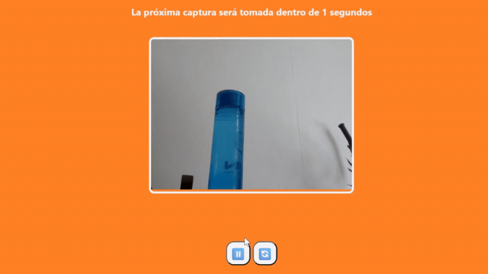

# WasteIt: Garbage Classifier & Materials Detector

Full-Stack Computer Vision web application designed to detect and classify 8 different types of waste materials in real-time to promote proper recycling.

**WasteIt** relies on a Deep Learning model to analyze camera frames and automatically categorize waste items into specific recycling groups.

---

### Demo
- **Frontend:** [https://m0ndares.github.io/WasteIt/src/html.html](https://m0ndares.github.io/WasteIt/src/html.html)
- **Backend API:** [https://wasteit.onrender.com](https://wasteit.onrender.com)

---

### The Problem
 Heavy models processing raw images without proper memory management frequently trigger out-of-memory crashes and race conditions.

### The Solution
This project implements an optimized and lightweight Full-Stack pipeline:
1. **Frontend:** Captures periodic video frames every 3 seconds via an HTML5 Canvas API and transmits them asynchronously to the backend.
2. **Backend:** Re-centers and squares the incoming image by dynamically injecting black borders via OpenCV to avoid aspect-ratio distortion.
3. **Inference:** Feeds the padded image into a custom-trained **ResNetV2** model running under a thread-safe environment to output the material class and prediction confidence.

---

### Key Features
* **8-Class Material Detection:** Accurately recognizes and segregates items into: `cardboard`, `metal`, `inorganic`, `plastic`, `paper`, `glass`, `organic`, and `battery`.
* **Thread-Safe Architecture:** Implements a Python `threading.Lock` mechanism inside Flask to safely handle concurrent API inference requests without breaking the model state.
* **Aspect-Ratio Preservation:** Preprocesses images by dynamically computing borders (`cv2.copyMakeBorder`) ensuring the objects do not warp before being resized to 224x224.
* **Memory-Optimized Pipeline:** Integrates active Python garbage collection (`gc.collect()`) and manual variable deletion after each prediction to prevent memory leaks in cloud deployments like Render.

---

### Tech Stack
- **Frontend:** HTML5, CSS3, Vanilla JavaScript
- **Backend API:** Python 3.12, Flask, Flask-CORS
- **Deep Learning Engine:** TensorFlow, ResNetV2
- **Image Processing:** OpenCV, NumPy

---

### Core Dependencies
* `tensorflow`
* `opencv-python`
* `flask`
* `keras`
* `numpy`